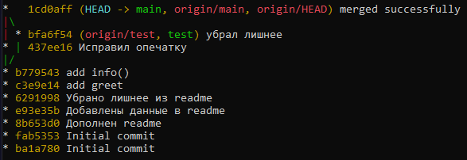

# work-with-git

Репозиторий для работы с git

План работ:

-   [Создаем свой первый репозиторий](#repo)
-   [Команды add, commit, push](#commit)
-   [Дополнительные возможности git](#advanced)
-   [Изучаем ветвление](#branch)
-   [Командная работа над проектом](#teamwork)

## Репозиторий <a name="repo"></a>

**Репозиторий** (repository) — директория проекта, который отслеживается Git. В директории хранится проект, история изменений и мета-информация проекта (в скрытой директории `.git`).

Скачать свой репозиторий с помощью консоли:

```
git clone https://github.com/<AUTHOR>/<REPO-NAME>
```

## add-commit-push <a name="commit"></a>

**Индекс** — временное хранилище, где лежат имена файлов и их изменения, которые должны быть добавлены в репозиторий. По факту индекс — просто файл. В индекс файлы сами не попадают, их нужно явно добавлять при помощи `git add`.

`git status` — показывает текущее состояние файлов в репозитории (какие файлы изменились, удалились, добавились);

`git log` — показывает историю изменений (это про зафиксированные изменения, то есть коммиты).

`git log --all --decorate --oneline --graph` - красиво показать в консоли граф всех изменений.



Локально сохранить прогресс изменений в `file1` и `file2`
(Добавить изменения в текущий коммит):

```
git add <file1> <file2>
```

Локально сохранить все изменения в проекте:

```
git add .
```

**Коммит (commit)** — это фиксация изменений в истории проекта (изменения, которые внесены в индекс). Коммит хранит изменённые файлы, имя автора коммита и время, в которое был сделан коммит. Кроме того, каждый коммит имеет уникальный идентификатор, который позволяет в любое время к нему откатиться. Можете считать коммит этакой точкой сохранения.

Зафиксировать изменения (сформировать коммит):

```
git commit
```

Каждый коммит представляет собой фиксированное состояние проекта и всех его файлов.
Залить все коммиты в репозиторий:

```
git push
```

## Работа с репозиторием <a name="advanced"></a>

`git pull` - загрузить текущую версию репозитория

`git diff` - подробно показывает все изменения

`git diff <file>` - показывает изменения только в файле `file`

## Ветвление <a name="branch"></a>

**Ветка (branch)** — последовательность коммитов. По сути — ссылка на последний коммит в этой ветке. Ветки не зависят друг от друга — можно вносить изменения в одну, и они не повлияют на другую (если вы явно этого не попросите). Работать вы начинаете в одной ветке — `main`.

`git checkout -b <branch-name>` - переместиться на ветку `<branch-name>`

`git branch` - посмотреть все ветки и узнать текущую

## Командная работа над проектом <a name="teamwork"></a>

**Форк (Fork)** — собственное ответвление (`fork`) какого-то проекта. Это означает, что GitHub создаст вашу собственную копию проекта, данная копия будет находиться в вашем пространстве имён, и вы сможете легко делать изменения путём отправки (`push`) изменений.

**Пул-реквест** — **pull request PR (пиар, он же merge request MR(мр))** — предложение изменения кода в чужом репозитории. Допустим, вы забрали к себе чужой репозиторий, поработали с ним и теперь хотите, чтобы ваши изменения попали в оригинальный репозиторий — тогда вы создаёте создаёте PR с просьбой добавить ваши изменения в репозиторий.
